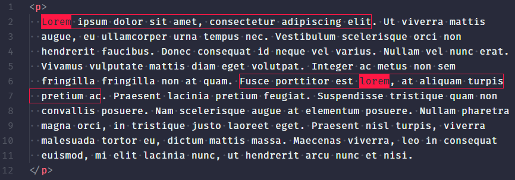

# Demo 3: Lorem Ipsum Hater

<p align="center">
  
</p>

For this third demo, we are going to build an HTML Lorem Ipsum Hater. It will highlight every instance of the word "lorem" and each sentence where the word was found. This demo was quite complex to build and a lot of research was needed from my side to get it working the way I wanted/expected.

The format for this demo/guide will also be a bit different than the previous ones. There is just a lot more code we need to get through so there will be less talking and more step by step instructions. There will be a lot of new functionality we did not discuss before so make sure you understand every new concept before continuing. I had a lot of fun getting everything working together so I hope you guys learn something from it.

## Generating & Preparing your new extension

I hope that by now you know what tooling is required in order to generate a new VS Code Extension, but if you don't please take a look at the [first demo](../demo-1-hello-world/README.md). So let's start by creating a new extension with the type of `New Extension (JavaScript)` or `New Extension (TypeScript)` by running:

`yo code`

Next, replace the entire content of your `extension.js` file with the following:

```javascript
const vscode = require('vscode');

function activate(context) {
  console.log('[ACTIVATED]');
}

exports.activate = activate;
```

In your package.json file remove everything from the `contributes` object and replace your `activationEvents` array with:

```json
"activationEvents": [
  "*"
]
```

The `*` activation event simply activates our extension whenever VS Code starts up. Please keep in mind that the `*` event should only be used when no other activation events combination work. You can find the full list of activation events in the [official documentation](https://code.visualstudio.com/api/references/activation-events).

## Developing your extension

Every instruction from now on should be implemented in your `extension.js` file. If you take a look at the image in the top of this document you can see that the word `lorem` has a different style than the sentence the word was found in. This means that we will need to create two different `TextEditorDecorator`'s. Text decorators are styling rules that can be applied to any character, in any file. Now, inside the `activate` function, under the `console.log()` add the following code snippet:

```javascript
const loremDecorationType = vscode.window.createTextEditorDecorationType({
  backgroundColor: '#FF1744',
  color: '#263238',
});

const loremSentenceDecorationType = vscode.window.createTextEditorDecorationType(
  {
    borderColor: '#FF1744',
    borderStyle: 'solid',
    borderWidth: '1px',
  },
);
```

You can edit these rules to your liking, just keep in mind that the options are very limited. Next, we need to get the user's active editor, we also need to know when the user opens another editor or when he changes to another VS Code window so we can get the new active editor instead.

Under the two decoration types add the following code:

```javascript
let activeEditor = vscode.window.activeTextEditor;
let timeout = null;

vscode.window.onDidChangeActiveTextEditor(
  editor => {
    activeEditor = editor;
    editor && triggerUpdateDecorations();
  },
  null,
  context.subscriptions,
);

vscode.workspace.onDidChangeTextDocument(
  event => {
    activeEditor &&
      event.document === activeEditor.document &&
      triggerUpdateDecorations();
  },
  null,
  context.subscriptions,
);

const triggerUpdateDecorations = () => {
  timeout && clearTimeout(timeout);
  timeout = setTimeout(updateDecorations, 250);
};

activeEditor && triggerUpdateDecorations();
```

- `activeEditor` is the variable where we store the currently active editor.
- The `triggerUpdateDecorations()` function checks if the `timeout` is set and if so, it deletes it. Then, it fires a new function called `updateDecorations()` after a short timeout of `250` milliseconds. This in order to limit how often our text decorations are applied, otherwise we can introduce input lag and/or bad performance.
- `onDidChangeTextDocument()` and `onDidChangeActiveTextEditor()` are event listeners that make sure `activeEditor` always refers to the currently active editor. It also runs the `triggerUpdateDecorations()` function if the active editor is changed.
